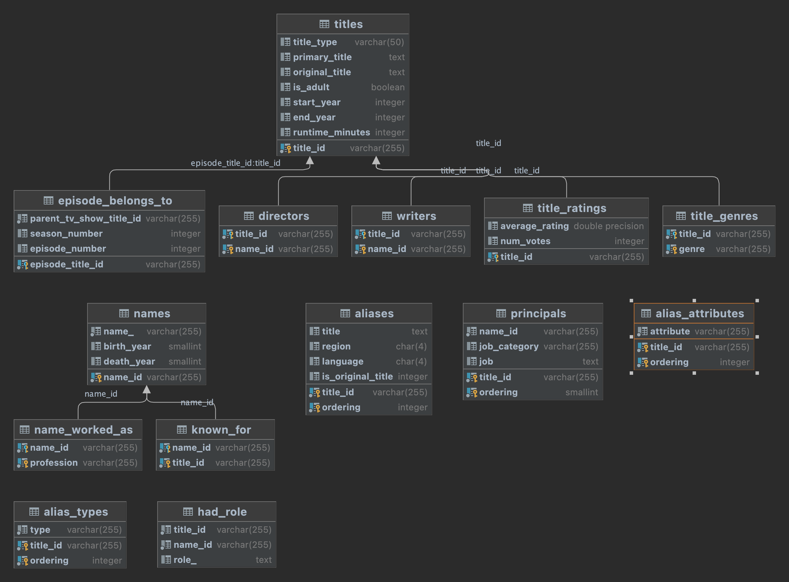
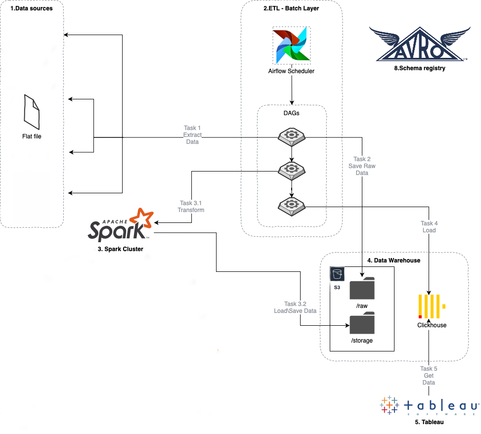

# Task

Based on the IMDb database: We want to solve the following questions.

1. Design a basic diagram of the relationship of the different datasets
2. Provide the average duration of movies by year of release.
If needed filter for movies with a release date >= 2000
2. Provide a localized title, region, and language of the top 100 movies with the highest
duration where the localized title (original title) is different from the original title. Again
you can filter for movies with a release date >= 2000 if needed.
3. How would you design a system for processing the previous questions on a daily basis
for generating reports by Analysts? Please just provide a concept
4. How would you design a system for processing in Real-Time the following use case
(again please just provide a concept): Provide top 10 movies with the highest average
rate.
5. Extra point: Can you provide us with a reproducible environment (maybe Postgres in
docker) where you load all the data into the database and rewrite questions 1-2 in SQL.
If needed you can use subsets of the data.

In this project we will build a Postgres database using the Internet Movie Database
(IMDb) dataset. The dataset consists of 7 compressed tab-separated-value files, which are explained and available for download from
[here](https://www.imdb.com/interfaces/). The data is refreshed daily.

## Dataset details

### name.basics.tsv.gz

Contains the following information for names:

  - nconst (string) - alphanumeric unique identifier of the name/person.
  - primaryName (string)– name by which the person is most often credited.
  - birthYear – in YYYY format.
  - deathYear – in YYYY format if applicable, else "\\N".
  - primaryProfession (array of strings) – the top-3 professions of the person.
  - knownForTitles (array of tconsts) – titles the person is known for.

### title.basics.tsv.gz

Contains the following information for titles:

  - tconst (string) - alphanumeric unique identifier of the title.
  - titleType (string) – the type/format of the title (e.g. movie, short,
    tvseries, tvepisode, video, etc).
  - primaryTitle (string) – the more popular title / the title used by the
  filmmakers on promotional materials at the point of release.
  - originalTitle (string) - original title, in the original language.
  - isAdult (boolean) - 0: non-adult title; 1: adult title.
  - startYear (YYYY) – represents the release year of a title. In the case of TV
  Series, it is the series start year.
  - endYear (YYYY) – TV Series end year. "\\N" for all other title types.
  - runtimeMinutes – primary runtime of the title, in minutes.
  - genres (string array) – includes up to three genres associated with the
  title.


### title.akas.tsv.gz

Contains the following information for titles:

  - titleId (string) - a tconst which is an alphanumeric unique identifier of
  the title.
  - ordering (integer) – a number to uniquely identify rows for a given titleId.
  - title (string) – the localised title.
  - region (string) - the region for this version of the title.
  - language (string) - the language of the title.
  - types (array) - Enumerated set of attributes for this alternative title. One
  or more of the following: "alternative", "dvd", "festival", "tv", "video",
  "working", "original", "imdbDisplay". New values may be added in the future
  without warning.
  **Please note that types is said to be an array. In the data we have this
  appears to not be true. There appears to be only one string for each pair of
  titleId and ordering values. Also, there are many NULL (\\N) values in this
  field (~95%).**

  - attributes (array) - Additional terms to describe this alternative title,
  not enumerated.
  **Please note that attributes is said to be an array. In the data we have this
  appears to not be true. There appears to be only one string for each pair of
  titleId and ordering values. There are many NULL (\\N) values in this field
  (~99%).**

  - isOriginalTitle (boolean) – 0: not original title; 1: original title.


### title.crew.tsv.gz

Contains the director and writer information for all the titles in IMDb. Fields
include:

  - tconst (string) - alphanumeric unique identifier of the title.
  - directors (array of nconsts) - director(s) of the given title.
  - writers (array of nconsts) – writer(s) of the given title.

### title.episode.tsv.gz

Contains the tv episode information. Fields include:

  - tconst (string) - alphanumeric identifier of episode.
  - parentTconst (string) - alphanumeric identifier of the parent TV Series.
  - seasonNumber (integer) – season number the episode belongs to.
  - episodeNumber (integer) – episode number of the tconst in the TV series.

### title.principals.tsv.gz

Contains the principal cast/crew for titles

  - tconst (string) - alphanumeric unique identifier of the title.
  - ordering (integer) – a number to uniquely identify rows for a given titleId.
  - nconst (string) - alphanumeric unique identifier of the name/person.
  - category (string) - the category of job that person was in.
  - job (string) - the specific job title if applicable, else "\\N".
  - characters (string) - the name of the character played if applicable, else
  "\\N" (It is really "[role1,role2,....]" or "\\N").

### title.ratings.tsv.gz

Contains the IMDb rating and votes information for titles

  - tconst (string) - alphanumeric unique identifier of the title.
  - averageRating – weighted average of all the individual user ratings.
  - numVotes - number of votes the title has received.
  

## Entity-Relationship (ER) diagram

The IMDb data as provided is not normalised. We first design an entity-relationship diagram for our IMDb relational database. This is shown below.
**Note: some tables not linked because some keys is not present in table "titles" and "names" and Postgress do not allow remove foreign keys check.**



## Prepare the IMDb data and build the IMDb database

### 1) Preprocess the IMDb datasets 

The IMDb data is processed using python. The script  `main.py`
reads in the 7 data files, cleans and normalises the IMDb data. After which, the
desired set of tables are output as tab-separate-value (tsv) files which stored in `data` folder.
To launch processing script install packages listed in `requirements.txt` and launch script.
```bash
$ python3 main.py
```

**Note: Due large amount of data script may take a long time to process.**

Datasets will be downloaded, unpacked, processed and stored in `data` folder. 
You can also just put unzipped datasets in the same folder and data will be also processed and saved.


### 2) Build Docker image with Postgres database

**Note: You need to have Docker installed**

The sequence of steps to build the Docker image are as follows:

1. Open terminal:

```bash
$ cd imdb_project
$ docker build -t pgimage .
$ docker-compose up -d
```
After the container is up it will be running init database scripts which were copied to `/docker-entrypoint-initdb.d/` folder in the container:

The SQL commands to build the database described above by the ER diagram and
logical schema are contained in 3 `*.sql scripts`:

- 01_create_table.sql
- 02_load_data.sql
- 03_create_views.sql

**Note: Due large amount of data after container is up it may take additional time to copy all datasets into Postgres database.
You can decrease size of datasets manually to increase load speed.**


## SQL Queries

After creating and loading data into the database, we can check queries to it:
- Provide the average duration of movies by year of release. If needed filter for movies with a release date >= 2000
- Provide a localized title, region, and language of the top 100 movies with the highest duration where the localized title (original title) is different from the original title. Again you can filter for movies with a release date >= 2000 if needed.
- Provide top 10 movies with the highest average
rate.

Queries presented in the file `03_create_views.sql`.
For each query we create a views.
The result of the query which is stored in the view can be seen by:

```sqlpostgres
SELECT * FROM avg_movie_duration;
SELECT * FROM top100_movie_duration;
SELECT * FROM top10_avg_rate;
```

Same queries completed via PySpark and presented in the file `queries.py`

## System design

We was asked about some system design questions:

- How would you design a system for processing the previous questions on a daily basis
for generating reports by Analysts? Please just provide a concept
- How would you design a system for processing in Real-Time the following use case
(again please just provide a concept).

### Generating reports by Analysts

1. I will prefer to use Airflow for ETL batch layer scheduling
2. Spark/AWS Glue for data extract, transform and load data
3. AWS S3 as storage for raw and processed data
4. Clickhouse as DataMart layer
5. Tableu for BI system and dashboards creating



First creating DAG in airflow will fetch data from the IMDB site.
For all time the first iteration we download data using the requests module, unpack zips and load raw tsv files for RAW backet storage in AWS S3.
After that we transform downloaded datasets to target tables depending on database schema shown before.
For this transformation, we use Spark or AWS Glue framework. Transformed data will be saved as parquets in STORAGE backet with target table names.
For the next iteration, we also download data from IMDB, unpack it and compare hashes of datasets with hashes of a dataset already stored in RAW backet to check if data in source was updated.
Using Airflow Sensor for that depends on data changed we will trigger a task for processing and storing new data in RAW and STORAGE backets.
Extract DAG and Transform are separated and Transform DAG triggers only if new data was uploaded in RAW storage.
For triggering using Airflow Sensors and Triggers.
The next step is to load into Clickhouse. We transfer parquets files from STORAGE backet using native Clickhouse transfer from S3.
To keep schema changes we use Avro Schema Registry and compare Avro schema with schema presented in clickhouse tables before load.
In case the source schema was changed we need to update it in Avro and reload STORAGE layer and recreate tables in Clickhouse.
After data is loaded in Clichouse analysts may connect to the database in creating dashboards via Tableu.

## Tests

Added some small tests for processed datasets using pytest lib. Tests presented in `tests` folder. To launch tests:
```bash
$ pytest test_title_ratings.py
```